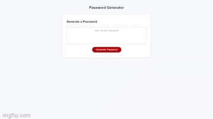

# 03 JavaScript: Password Generator

[Not available yet-See the deployment](https://gulpinhenry.github.io/password-generator/)

 
---

## Table of Contents

- [03 JavaScript: Password Generator](#03-javascript-password-generator)
  - [Table of Contents](#table-of-contents)
  - [About the Project](#about-the-project)
  - [Technologies](#technologies)
  - [Usage](#usage)
  - [License](#license)
  - [Questions](#questions)

## About the Project
 A Password Generator created to experiment with implementing JavaScript to HTML and CSS.

  

## Technologies
 - * [HTML](https://developer.mozilla.org/en-US/docs/Web/HTML)
 - * [CSS](https://developer.mozilla.org/en-US/docs/Web/CSS)

## Usage

Press generate password, insert parameters, use generated password!

## License

This application is covered under the MIT license

## Questions

For any questions, please reach out by creating an issue.

Developer's Repos   
[Henry Kam](https://github.com/gulpinhenry)